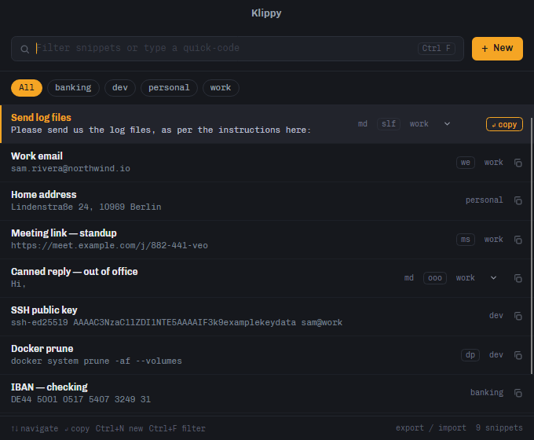

# Klippy

A small, cross-platform snippet, actions, and clipbpard manager. Store pieces of text, 
find them instantly, and put them on the clipboard with one click, tap, or keystroke. 
Store and access your clipboard history.  Run actions such as opening files or URLs.
Built with .NET 10 and [Avalonia UI](https://avaloniaui.net/) for Windows, macOS, Android, and iOS.

**📖 [Full documentation](https://seankearon.github.io/klippy/)**



---

## Finding snippets

Two ways, both designed for speed:

- **Quick-codes** — a snippet can carry a short code (e.g. `slf` for "Send log files").
  Type the code in the search box and it jumps straight to the top; press Enter to copy.
- **Search** — every space-separated term must prefix-match a word anywhere in the
  label, content, or tag. `log fil` finds "…send us the **log** **fil**es…".

The index is precomputed, lowercased words per snippet
([`SnippetSearch`](Klippy/Services/SnippetSearch.cs)), so a keystroke costs a linear
scan of ordinal `StartsWith` checks — microseconds for thousands of snippets.

→ [Finding snippets](https://seankearon.github.io/klippy/finding-snippets/)

## Running things

Some snippets are not text you want to paste — they are a link you want open, a script
you want run, or an application you want started. A snippet can be marked **Execute** in
the editor, and then triggering it runs it instead of copying it. Without the marker
nothing runs: Klippy never decides on its own that a snippet looks like a link and
should therefore be launched.

→ [Running things](https://seankearon.github.io/klippy/running-things/) ·
[Running an unmatched search](https://seankearon.github.io/klippy/unmatched-search/)

## Variables

A `klippy.vars` file holds local defines that resolve into snippets at trigger time and
are **never exported** — so a snippet can carry your account number without the export
carrying it too. One name can hold two flavours, and the item picks the one it needs.

→ [Variables](https://seankearon.github.io/klippy/variables/)

## Clipboard history

On Windows, Klippy keeps a history of what you copied — text, files and images — with a
deliberate list of what is *not* recorded, so a password manager's clipboard never lands
in it.

→ [Clipboard history](https://seankearon.github.io/klippy/clipboard-history/)

---

## Documentation

Everything above, in full:

| | |
| --- | --- |
| [Finding snippets](https://seankearon.github.io/klippy/finding-snippets/) | Quick-codes, search, ranking, the keyboard |
| [Running things](https://seankearon.github.io/klippy/running-things/) | Links, scripts, applications, macros, environment variables |
| [Running an unmatched search](https://seankearon.github.io/klippy/unmatched-search/) | Typing a line nothing matches, and running it |
| [Recent commands](https://seankearon.github.io/klippy/recent-commands/) | The MRU, and what stays out of it |
| [Markdown snippets](https://seankearon.github.io/klippy/markdown-snippets/) | Pasting rich text into editors that accept it |
| [Variables](https://seankearon.github.io/klippy/variables/) | Local defines, resolution order, arguments, flavours |
| [Clipboard history](https://seankearon.github.io/klippy/clipboard-history/) | Text, files and images on Windows |
| [Global hotkeys](https://seankearon.github.io/klippy/global-hotkeys/) | Summoning Klippy from anywhere |
| [Settings](https://seankearon.github.io/klippy/settings/) | Every setting and what it changes |
| [Export / import](https://seankearon.github.io/klippy/export-import/) | Moving snippets between machines |
| [Where data lives](https://seankearon.github.io/klippy/data-and-backup/) | The store, the folder, and backup |
| [Building](https://seankearon.github.io/klippy/building/) | Building, publishing and packaging |
| [Design](https://seankearon.github.io/klippy/design/) | The visual language and its fonts |

The docs are built with [Zensical](https://zensical.org/) from the `docs/` folder in this
repository. **`release.ps1` builds and publishes them** — the *Verify Docs* stage builds
the site with `--strict` before anything is signed or tagged, so a broken link stops the
release, and *Publish Docs* force-pushes the result to the `gh-pages` branch that Pages
serves. [`.github/workflows/docs.yml`](.github/workflows/docs.yml) only validates the
build on pull requests; it does not publish.

That means the published site always describes the **released** version, not `main`.

Zensical needs to be on PATH on the release machine:

```powershell
uv tool install zensical    # or: pip install zensical
```

Set `ZENSICAL` to its full path if you keep it in a virtual environment, or pass
`-NoDocs` to release without touching the documentation. To preview locally:

```bash
zensical serve
```

## Building

```bash
dotnet build Klippy.slnx
dotnet run --project Klippy.Desktop
```

→ [Building](https://seankearon.github.io/klippy/building/) for publishing, packaging and
the Android build.
