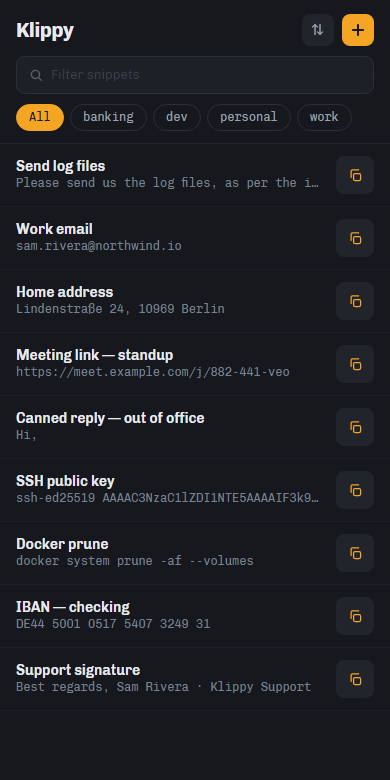

## What it does { .klippy-section-title }

-   :material-magnify:{ .lg .middle } **Finds it before you finish typing**

    ---

    Give a snippet a **quick-code** — `slf` for "Send log files" — and it jumps to the
    top. Or search: every space-separated term prefix-matches a word in the label,
    content or tag. The index is precomputed, so a keystroke costs microseconds.

    [:octicons-arrow-right-24: Finding snippets](finding-snippets.md)

-   :material-play:{ .lg .middle } **Runs things, not just pastes them**

    ---

    Some snippets are a link to open, a script to run or an app to start. Mark one
    **Execute** and triggering it runs it. Without the marker nothing runs — Klippy
    never decides on its own that something looks launchable.

    [:octicons-arrow-right-24: Running things](running-things.md)

-   :material-code-braces:{ .lg .middle } **Keeps your secrets local**

    ---

    A `variables.txt` file holds local defines that resolve into snippets at trigger
    time and are **never exported**. One name can carry two flavours, so an item
    picks the form it needs.

    [:octicons-arrow-right-24: Variables](variables.md)

-   :material-clipboard-list:{ .lg .middle } **Remembers what you copied**

    ---

    Clipboard history on Windows covers text, files and images — with a deliberate
    list of what is *not* recorded, so a password manager's clipboard never lands
    in it.

    [:octicons-arrow-right-24: Clipboard history](clipboard-history.md)

-   :material-keyboard:{ .lg .middle } **Comes when called**

    ---

    A global hotkey summons Klippy over whatever you are working in, on Windows and
    macOS. Type, press ++enter++, and it is on your clipboard and out of your way.

    [:octicons-arrow-right-24: Global hotkeys](global-hotkeys.md)

-   :material-cellphone-link:{ .lg .middle } **Same snippets, every device**

    ---

    One .NET 10 and Avalonia codebase for Windows, macOS, Android and iOS. Export
    from one, import to another, and your store travels with you.

    [:octicons-arrow-right-24: Export / import](export-import.md)

## On mobile { .klippy-section-title }

<figure markdown="span">
  { width="300" }
  <figcaption>Swipe a row for its actions; tap to copy.</figcaption>
</figure>
